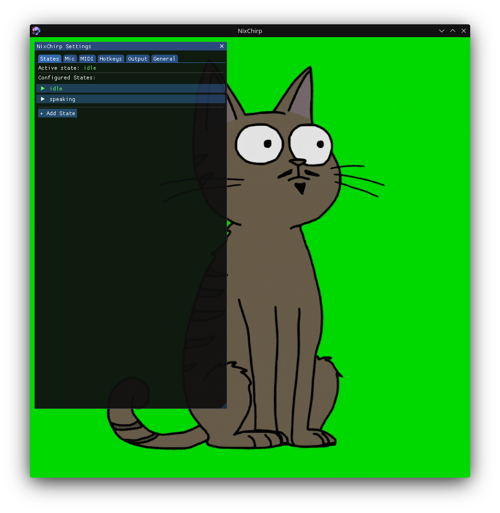
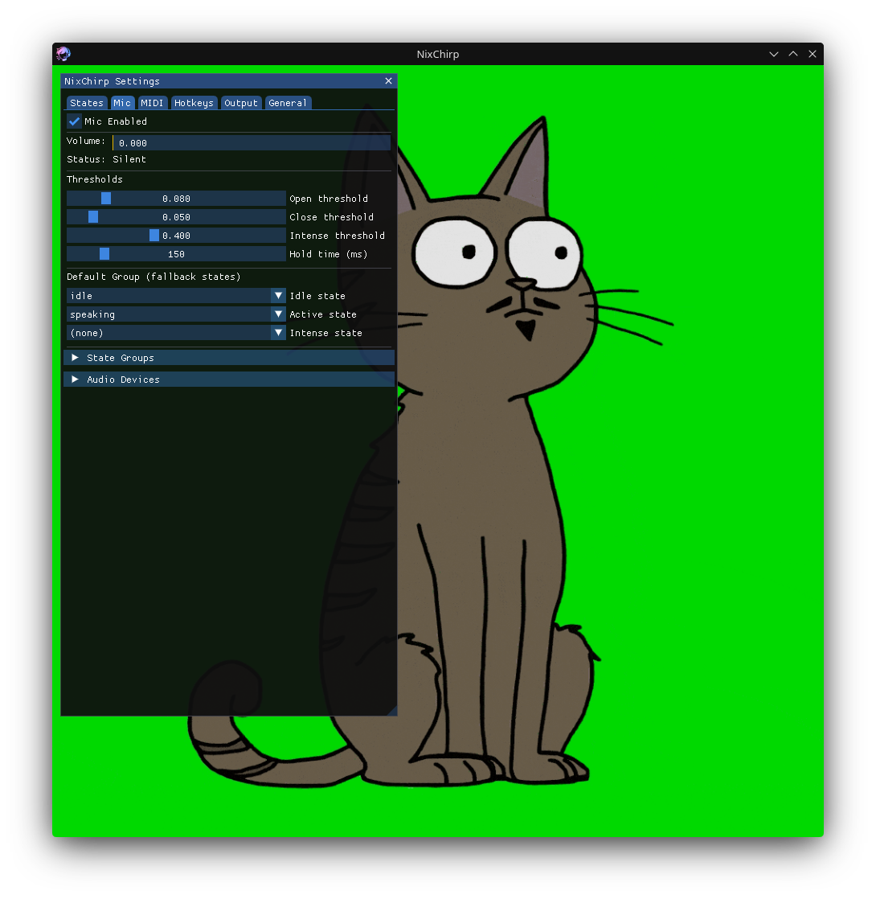
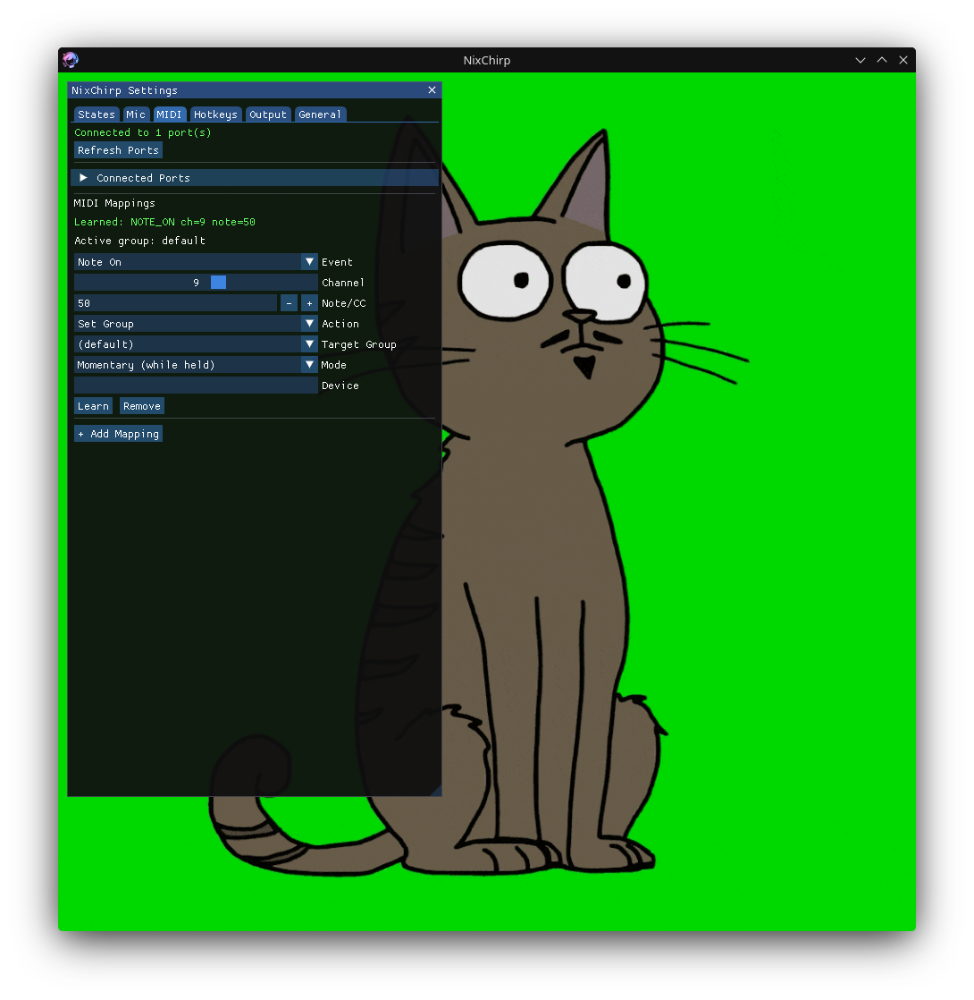
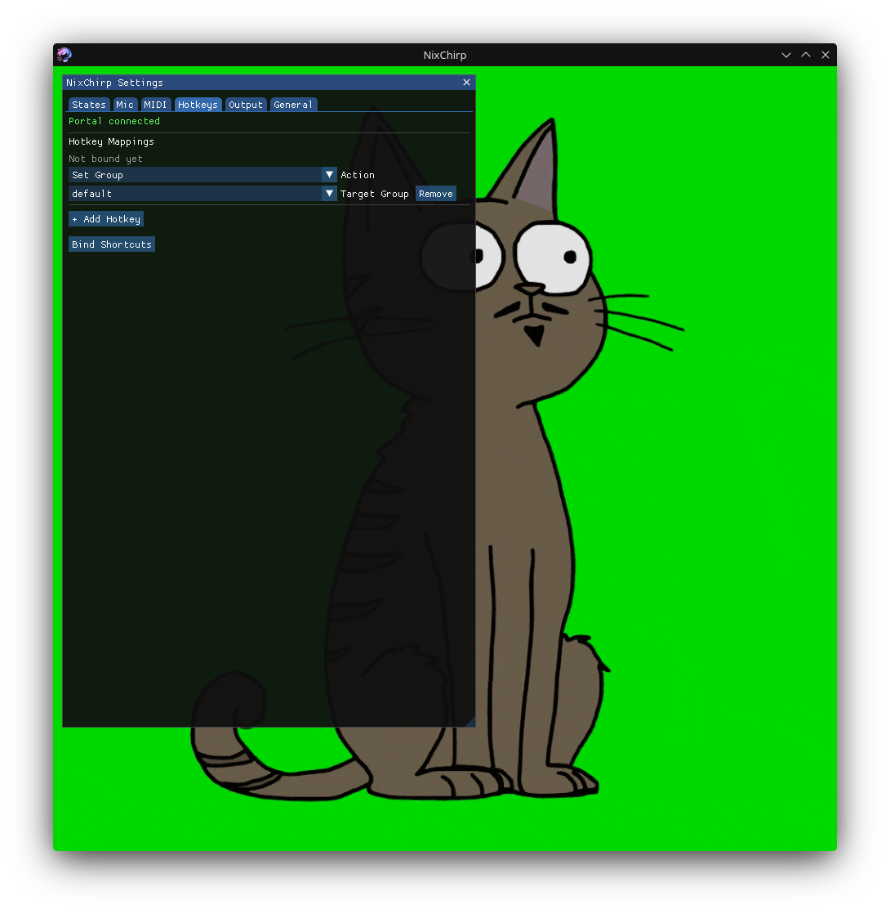
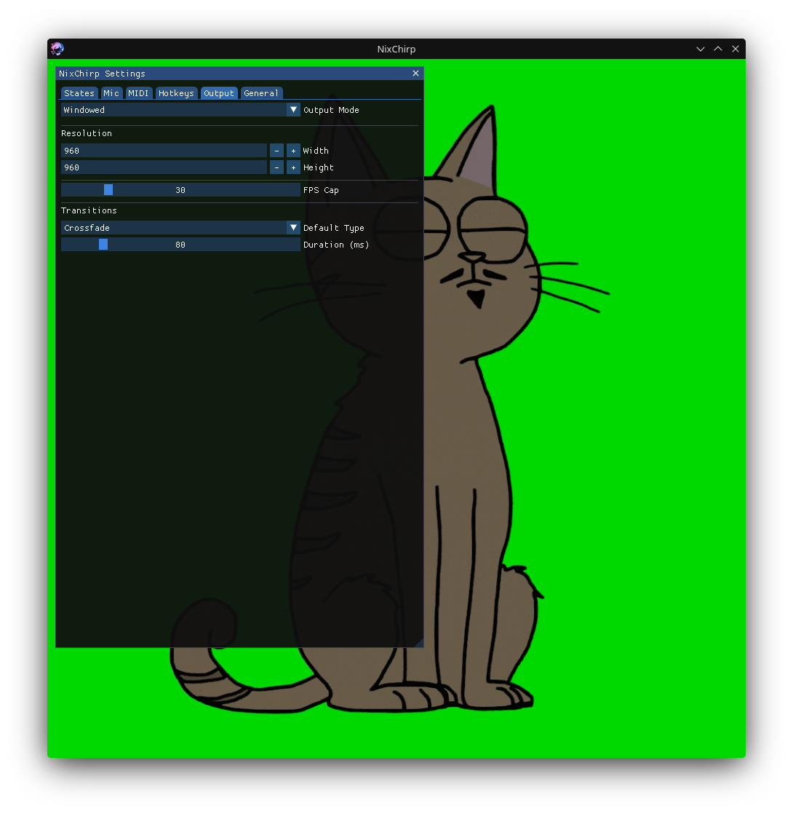
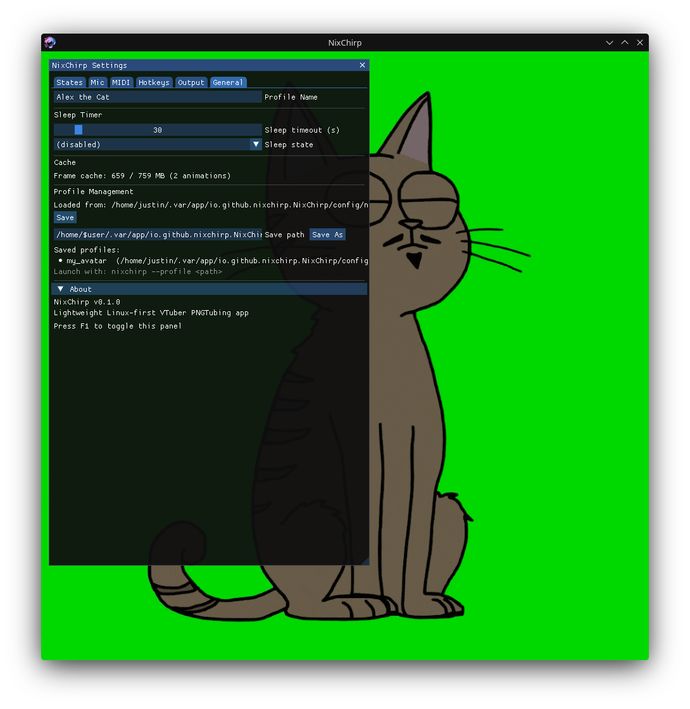

<p align="center">
  
</p>

<h1 align="center">NixChirp</h1>

<p align="center">
  Lightweight, Linux-first VTuber PNGTubing app
</p>

<p align="center">
  <a href="#installation">Installation</a> &bull;
  <a href="#features">Features</a> &bull;
  <a href="#usage">Usage</a> &bull;
  <a href="#building-from-source">Building from Source</a> &bull;
  <a href="#license">License</a>
</p>

---

NixChirp displays animated avatars (GIF, APNG, WebM) that react to your microphone in real time — mouth opens when you speak, closes when you're silent. It's a lightweight alternative to veadotube-mini built natively for Linux, using a fraction of the resources.

<p align="center">
  
  
</p>

## Features

- **Mic-reactive avatar states** — idle, speaking, and intense states with configurable thresholds, noise gate, and hysteresis
- **MIDI controller support** — map buttons to switch avatar groups with momentary hold or toggle modes
- **Global hotkeys** — system-native key binding via XDG Desktop Portal (Wayland & X11)
- **Multiple output modes** — windowed, chroma key, transparent window, or virtual camera (v4l2loopback)
- **Smooth transitions** — crossfade blending between states
- **Sleep timer** — automatically switch to an idle animation after configurable inactivity
- **Full GUI** — configure everything through an in-app settings panel (press F1)
- **Lightweight** — typically under 200 MB RAM, runs on integrated graphics

<details>
<summary>More screenshots</summary>
<p>
  
  
  
  
</p>
</details>

## Installation

### Flatpak (recommended)

Download `NixChirp.flatpak` from the [latest release](https://github.com/LoweValu/NixChirp/releases) and install it:

```bash
flatpak install NixChirp.flatpak
```

Or double-click the file — your software center will handle it.

Run it from your application launcher, or from the terminal:

```bash
flatpak run io.github.nixchirp.NixChirp
```

### pip (from source)

Requires Python 3.11+ and PortAudio (`libportaudio2`) installed on your system.

```bash
pip install nixchirp[all]
nixchirp
```

## Usage

On first launch, NixChirp loads a bundled example avatar (Alex the Cat) and opens the settings panel automatically.

**Quick start:**

1. Press **F1** to open/close the settings panel
2. Go to the **States** tab to add your avatar GIF/APNG/WebM files
3. Go to the **Mic** tab to assign idle and speaking states
4. Adjust the mic threshold until the status shows "Speaking" when you talk
5. Go to the **General** tab and click **Save As** to save your profile

**Load a profile on launch:**

```bash
nixchirp --profile ~/my_avatar.toml
```

**Other options:**

```
nixchirp --help
nixchirp --version
nixchirp --output-mode chroma
nixchirp --fps 60
```

### OBS Integration

NixChirp offers several ways to capture your avatar in OBS:

| Method | Setup |
|--------|-------|
| **Window capture** | Add a Window Capture source, select the NixChirp window |
| **Chroma key** | Set output mode to "chroma", add a Color Key filter in OBS |
| **Transparent window** | Set output mode to "transparent", use Window Capture with Allow Transparency |
| **Virtual camera** | Set output mode to "virtual_cam", add a Video Capture source for the v4l2loopback device |

For virtual camera output, you'll need the `v4l2loopback` kernel module. NixChirp can load it for you from the Output settings panel.

## Supported Formats

| Format | Extension | Notes |
|--------|-----------|-------|
| GIF | `.gif` | Animated GIFs, any resolution |
| APNG | `.apng`, `.png` | Animated PNGs with transparency |
| WebM | `.webm` | VP8/VP9 video, supports transparency |

## Building from Source

```bash
git clone https://github.com/LoweValu/NixChirp.git
cd NixChirp
python3 -m venv .venv
.venv/bin/pip install -e ".[all]"
.venv/bin/nixchirp
```

### Building the Flatpak

```bash
# Install build tools and runtime
sudo dnf install flatpak-builder
flatpak install flathub org.freedesktop.Platform//24.08 org.freedesktop.Sdk//24.08

# Build and bundle
flatpak-builder --force-clean --repo=repo build-dir io.github.nixchirp.NixChirp.yml
flatpak build-bundle repo NixChirp.flatpak io.github.nixchirp.NixChirp

# Install locally
flatpak install --user NixChirp.flatpak
```

## Dependencies

**Core:** PySDL2, PyOpenGL, PyAV (`av`), Pillow, NumPy, tomli-w

**Input:** sounddevice (+ PortAudio), alsa-midi, dbus-fast

**GUI:** imgui-bundle

All dependencies are bundled automatically in the Flatpak.

## License

Apache 2.0 — see [LICENSE](LICENSE) for details.
